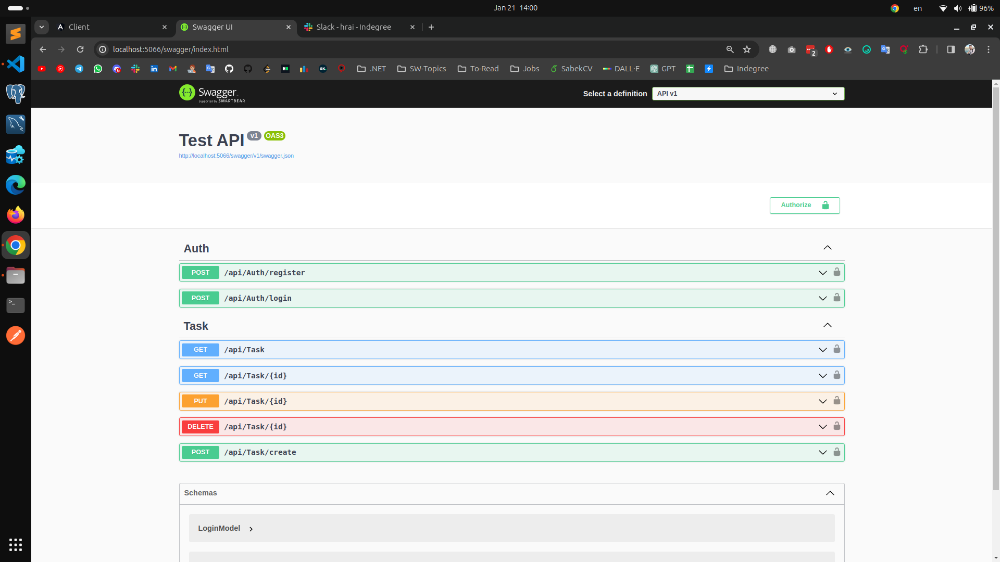
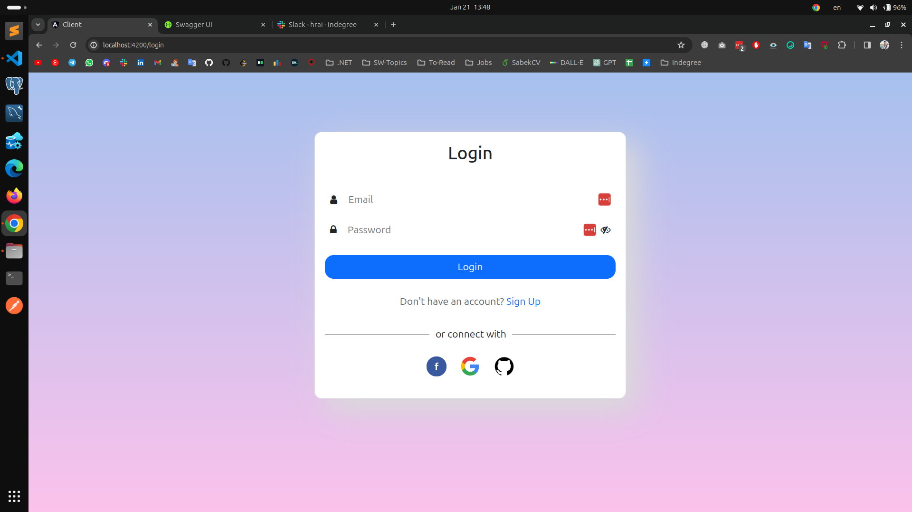
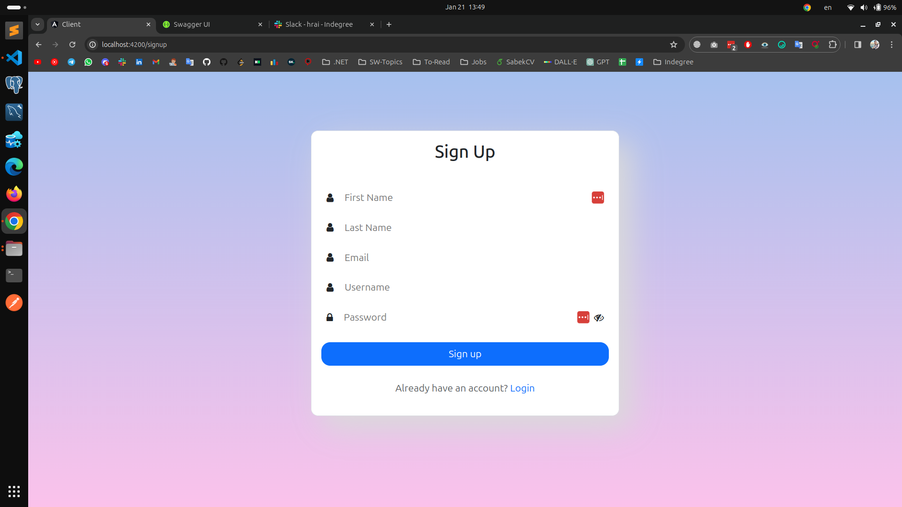
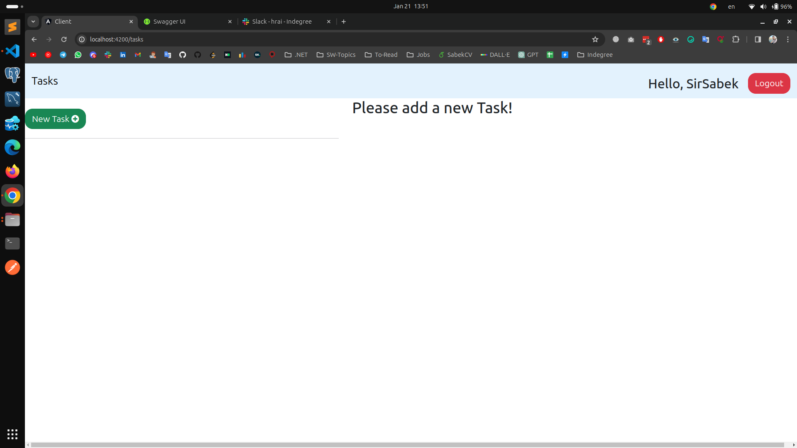
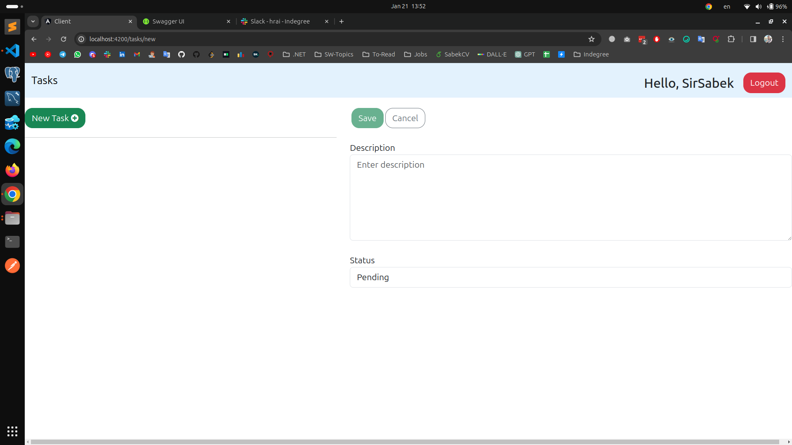
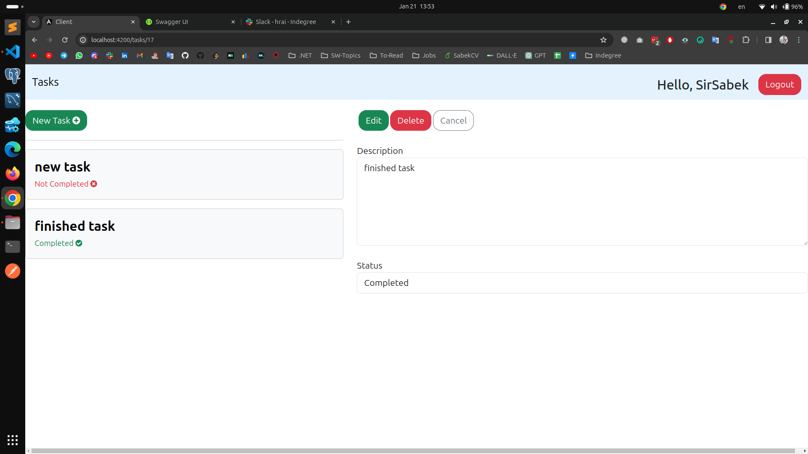

<h1 align="center">Todo App</h1>

## Backend

### Implementation Details

This project employs various design patterns and technologies to foster a clean, maintainable codebase:

### Repository Pattern

The Repository Pattern is utilized to abstract the data layer, enhancing the application's maintainability, testability, and modularity. By decoupling the logic for data retrieval and mapping from the business logic, it promotes a separation of concerns.

### Unit of Work Pattern

The Unit of Work Pattern is employed to maintain a list of objects affected by a business transaction and coordinates the writing out of changes. This ensures that changes are made in a transactional manner, contributing to data integrity.

### JWT (JSON Web Tokens)

JSON Web Tokens (JWT) are employed for secure information transmission between parties. The digitally signed tokens facilitate trust and verification. It's crucial to implement secure practices, such as robust key management, token expiration, and transmission over HTTPS.

### Database Design (EF Core Code First)

The database design follows the EF Core Code First approach, allowing for the generation of the database schema based on the application's models. This approach offers control over models, making it suitable for Domain-Driven Design and Test-Driven Development. Migrations are managed effectively to evolve the schema as the application progresses.

### Authentication (Identity Framework)

Identity Framework is integrated for authentication, providing a framework for managing and storing user accounts in ASP.NET Core apps. Its features, including account confirmation, password recovery, and two-factor authentication, enhance the overall security of the application. Consider customizing Identity Framework to meet specific application needs.

### Additional Considerations

- **Dependency Injection**: Leverage ASP.NET Core's dependency injection for injecting repositories into services, enhancing modularity and testability.

### Technologies and Tools

### Swagger

## Client

<h3>Technologies Used</h3>

  
  
  
  
  

<h3>Features and Description</h3>

The Todo-App's features include:

<h4>Login page</h4>

<h4>Sign up page</h4>

<h4>Home</h4>

<h4>Adding a new task</h4>

<h4>Editing a task</h4>

